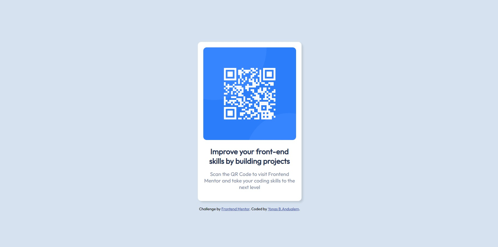

# Frontend Mentor - QR code component solution

This is a solution to the [QR code component challenge on Frontend Mentor](https://www.frontendmentor.io/challenges/qr-code-component-iux_sIO_H). Frontend Mentor challenges help you improve your coding skills by building realistic projects. 

## Table of contents

- [Overview](#overview)
  - [Screenshot](#screenshot)
  - [Links](#links)
- [My process](#my-process)
  - [Built with](#built-with)
- [Author](#author)

## Overview

### Screenshot
#### Desktop

#### Mobile

### Links

- Solution URL: [Add solution URL here](https://www.frontendmentor.io/solutions/qr-code-component-solution-yNUSAqbNMp)
- Live Site URL: [QR Code Challenge](https://qrchallenge-frontendmentor.netlify.app/)

## My process
### Built with

- Semantic HTML5 markup
- CSS custom properties
- Flexbox
- CSS Grid

## Author

- Website - [Yonas B.Andualem](https://www.yonasberhanuandualem.tech)
- Frontend Mentor - [@yourusername](https://www.frontendmentor.io/profile/Yonas1472)
- Twitter - [@yourusername](https://www.twitter.com/14_jonahb)
- Instagram - [@yourusername](https://www.instagram.com/14_jonah)
- Linkedin - [@yourusername](https://www.lnkedin.com/in/yonasandualem14/)
- Github - [@yourusername](https://www.github.com/Yonas1472)

